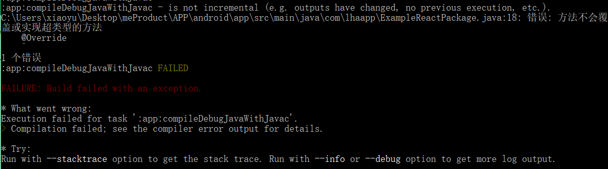

### 接入Android原生模块

  - 按照官方的说法，第一步需要创建一个java类本例中为：ToastModule，并继承ReactContextBaseJavaModule，然后复写getName()方法，其返回值，就是在react-native中引用的组件名称

  - 复写 getConstants()方法可以返回一些常量用于react-native中调用，官方文档中 return "ToastAndroid" 这个名称在原生的组件中已经存在，返回相同的名称将会冲突，so:改个名字吧！！

  - @ReactMethod注解：用于java返回一个react-native中可调用的方法 ，其不能有返回值所以使用 void

  - 注册模块：创建java类本例中为：ExampleReactPackage，实现ReactPackage接口

  - 复写createJSModules() , createViewManagers() 方法，返回Collections.emptyList()空集合

  - createNativeModules()方法中添加我们需注册的模块对象，new ToastModule(),并返回模块集合

  - 添加已注册模块对象到返回集合中，向react-native抛出模块，如：第三步

  - 在react-native中调用，如：第四步

  #### android目录结构
  
  #### 注意：引入包的名称不要弄错了

  #### 1. 第一步 创建模块类
  在androidtoast目录下，创建一个ToastModule.java的类
  ```java
  package com.androidtoast; //包名

  import android.widget.Toast; //引入调用的类

  import com.facebook.react.bridge.ReactApplicationContext;
  import com.facebook.react.bridge.ReactContextBaseJavaModule;
  import com.facebook.react.bridge.ReactMethod;
  import com.facebook.react.uimanager.IllegalViewOperationException;

  import java.util.Map;
  import java.util.HashMap;

  public class ToastModule extends ReactContextBaseJavaModule {

      private static final String DURATION_SHORT_KEY = "SHORT";
      private static final String DURATION_LONG_KEY = "LONG";

      public ToastModule(ReactApplicationContext reactContext) {
          super(reactContext);
      }

      // 复写方法，返回react-native中调用的 组件名
      @Override
      public String getName() {
          return "ToastNative";
      }
      // 复写方法，返回常量
      @Override
      public Map<String, Object> getConstants() {
          final Map<String, Object> constants = new HashMap<>();
          constants.put(DURATION_SHORT_KEY, Toast.LENGTH_SHORT);
          constants.put(DURATION_LONG_KEY, Toast.LENGTH_LONG);
          return constants;
      }
      // 使用 @ReactMethod注解返回react-native中可调用的 方法
      @ReactMethod
      public void show(String message, int duration) {
          Toast.makeText(getReactApplicationContext(), message, duration).show();
      }
  }
  ```
  #### 2. 第二步 注册模块
  ```java
  package com.androidtoast;

  import android.widget.Toast;

  import com.facebook.react.bridge.NativeModule;
  import com.facebook.react.bridge.ReactApplicationContext;
  import com.facebook.react.bridge.ReactMethod;
  import com.facebook.react.ReactPackage;
  import com.facebook.react.bridge.JavaScriptModule;
  import com.facebook.react.uimanager.ViewManager;

  import java.util.ArrayList;
  import java.util.Collections;
  import java.util.List;

  public class ExampleReactPackage implements ReactPackage {

      @Override
      public List<Class<? extends JavaScriptModule>> createJSModules() {
          return Collections.emptyList();
      }

      @Override
      public List<ViewManager> createViewManagers(ReactApplicationContext reactContext) {
          return Collections.emptyList();
      }

      @Override
      public List<NativeModule> createNativeModules(
              ReactApplicationContext reactContext) {
          List<NativeModule> modules = new ArrayList<>();

          modules.add(new ToastModule(reactContext));

          return modules;
      }
  }
  ```
  #### 3. 第三步 添加注册类
  添加到 MainApplication.java 中的getPackages()方法中
  ```java
  @Override
  protected List<ReactPackage> getPackages() {
    return Arrays.<ReactPackage>asList(
        new MainReactPackage(), // 这个是自动创建
        new ExampleReactPackage() // 这个类是我们创建的
    );
  }
  ```
  ##### 项目结构如下：
  
  > Java部分的代码就结束了，再次提醒下：包名啊！！不要弄错了！！！

  #### 4. 第四步 修改react-native代码引入原生模块

  ```js
  import { NativeModules } from 'react-native';
  let toast = NativeModules.ToastNative;
  ```
  ##### 通过调用 toast.show('Toast message',toast.SHORT);

  #### 5. 运行程序 react-native run-android

  > 注意程序有可能报一个错误 
  

  提示@override错误是因为react-native的0.47.0移除该方法，所以去掉createJSModules函数就好了

  参考连接： [react-native-nativeModule](https://github.com/Xing-He/react-native-native-module/blob/master/README.md)
  [方法不会覆盖或实现超类型的方法 #145](https://github.com/lovebing/react-native-baidu-map/issues/145)
