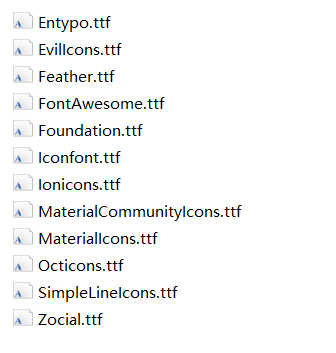
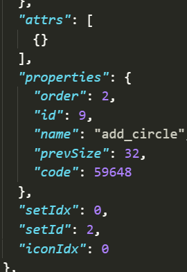
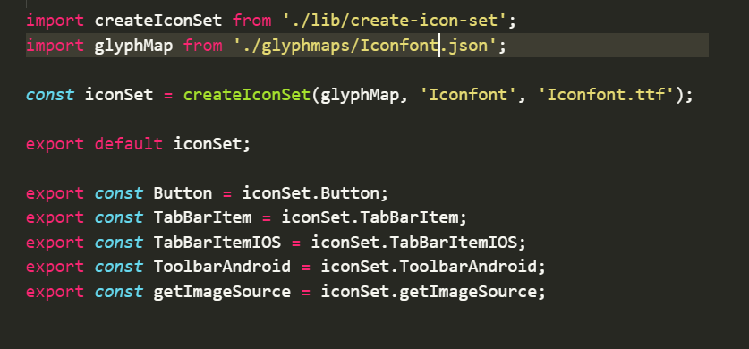
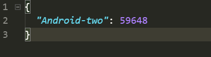

###react-native-vector-icons Android配置
 
 1. 编辑android/settings.gradle

```js
  rootProject.name = '项目名字'
  + include ':react-native-vector-icons'
  + project(':react-native-vector-icons').projectDir = new File(rootProject.projectDir, '../node_modules/react-native-vector-icons/android')

  include ':app'
```

2. 编辑android/app/build.gradle

```js
  dependencies {
    compile fileTree(dir: 'libs', include: ['*.jar'])
    compile "com.android.support:appcompat-v7:23.0.1"
    compile "com.facebook.react:react-native:+"  // From node_modules
    + compile project(':react-native-vector-icons')
  }
```

3. 编辑 android/app/src/main/java/MainApplication.java文件

```js
  package com.myapp;

  + import com.oblador.vectoricons.VectorIconsPackage;

  ....

  @Override
  protected List<ReactPackage> getPackages() {
    return Arrays.<ReactPackage>asList(
      new MainReactPackage()
  +   , new VectorIconsPackage()
    );
  }
}
```
> 千万不要忘记加逗号，要不然会很尴尬的。

4. 删除 node_modules/react-native/local-cli/core/ _ fixtures _/files/package.json 文件
5. Android下不要忘记在\android\app\src\main\assets\fonts 添加你的图标文件 

> 基本大功告成了

### 自定义图标

  1. 我使用的图标库 https://icomoon.io/, 通过 Import Icons 导入自己的svg图片 
  
  2. 下载解压后得到一歌json文件，并打开, code就是我们需要的字码
  

  1. 在node_modules/react-native-vector-icons目录下创建Iconfont.js，内容就拷贝Ionicons.js，并将里面的Ionicons字段全部改成Iconfont，如下
  

  2. 然后在node_modules/react-native-vector-icons/glyphmaps中创建Iconfont.json，内容格式如下
  
  3. 这样直接引用就可以了
  ```js
    import Icon from 'react-native-vector-icons/Iconfont';
    <Icon name='Android-two' size={20} color='#fff' />
  ```
  > 大功告成

  使用react-native-vector-icons大多都需要自定义，将项目图片转为ttf字体图标进行使用。框架的使用及自定义详细见：https://github.com/oblador/react-native-vector-icons

  参考文章：https://blog.csdn.net/u010940770/article/details/71429599