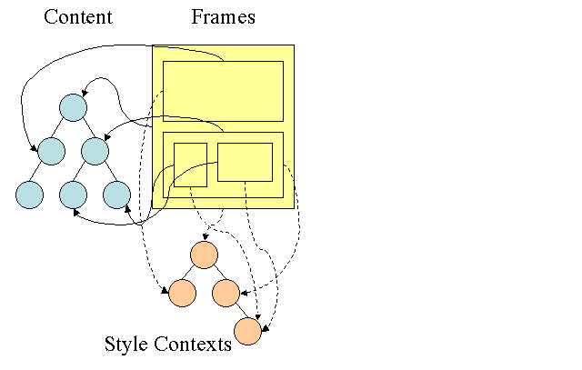
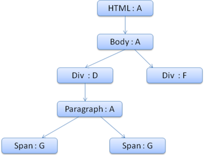

### 浏览器渲染页面过程与页面优化
<hr>

  <font size=3>由一道面试题引发的思考：</font>
  <font size=3>从用户输入浏览器输入url到页面最后呈现 有哪些过程？</font>
  <font size=3>一道很常规的题目，考的是基本网络原理，和浏览器加载css，js过程。</font>
  <font size=3>答案大致如下：</font>

  <strong><font size=3>1. 用户输入URL地址</font></strong>
  <strong><font size=3>2. 浏览器解析URL解析出主机名</font></strong>
  <strong><font size=3>3. 浏览器将主机名转换成服务器ip地址（浏览器先查找本地DNS缓存列表 没有的话 再向浏览器默认的DNS服务器发送查询请求 同时缓存）</font></strong>
  <strong><font size=3>4. 浏览器将端口号从URL中解析出来</font></strong>
  <strong><font size=3>5. 浏览器建立一条与目标Web服务器的TCP连接（三次握手）</font></strong>
  <strong><font size=3>6. 浏览器向服务器发送一条HTTP请求报文</font></strong>
  <strong><font size=3>7. 服务器向浏览器返回一条HTTP响应报文</font></strong>
  <strong><font size=3>8. 关闭连接 浏览器解析文档</font></strong>
  <strong><font size=3>9. 如果文档中有资源 重复6 7 8 动作 直至资源全部加载完毕</font></strong>

  <font size=3>以上答案基本简述了一个网页基本的响应过程背后的原理。</font>
  <font size=3>但这也只是一部分，浏览器获取数据的部分，至于浏览器拿到数据之后，怎么渲染页面的，一直没太关注。</font>
  <font size=3>所以抽出时间研究下浏览器渲染页面的过程。</font>

  <strong>通过研究，了解一些基本常识的原理：</strong>
  <strong><font size=3>1. 为什么要将js放到页脚部分</font></strong>
  <strong><font size=3>2. 引入样式的几种方式的权重</font></strong>
  <strong><font size=3>3. css属性书写顺序建议</font></strong>
  <strong><font size=3>4. 何种类型的DOM操作是耗费性能的</font></strong>

  <h4>浏览器渲染主要流程</h4>
  <hr>
  <font size=3>不同的浏览器内核不同，所以渲染过程不太一样。</font>
  <br>

  
  <font size=3>WebKit 主流程</font>

  
  <font size=3>Mozilla 的 Gecko 呈现引擎主流程</font>

  <font size=3>由上面两张图可以看出，虽然主流浏览器渲染过程叫法有区别，但是主要流程还是相同的。Gecko 将视觉格式化元素组成的树称为“框架树”。每个元素都是一个框架。WebKit 使用的术语是“呈现树”，它由“呈现对象”组成。对于元素的放置，WebKit 使用的术语是“布局”，而 Gecko 称之为“重排”。对于连接 DOM 节点和可视化信息从而创建呈现树的过程，WebKit 使用的术语是“附加”。</font>

  <strong><font size=3>所以可以分析出基本过程：</font></strong>

  <font size=3>1. HTML解析出DOM Tree</font>
  <font size=3>2. CSS解析出Style Rules</font>
  <font size=3>3. 将二者关联生成Render Tree</font>
  <font size=3>4. Layout 根据Render Tree计算每个节点的信息</font>
  <font size=3>5. Painting 根据计算好的信息绘制整个页面</font>
  
  <h4>HTML解析</h4>
  <hr>

  <font size=3>HTML Parser的任务是将HTML标记解析成DOM Tree
  这个解析可以参考React解析DOM的过程，
  但是这里面有很多别的规则和操作，比如容错机制，识别等等。
  感兴趣的可以参考 <a href='https://www.html5rocks.com/en/tutorials/internals/howbrowserswork/'>《How Browser Work》</a>，中文翻译
  举个例子：一段HTML</font>

  ```html
    <html>
    <head>
        <title>Web page parsing</title>
    </head>
    <body>
        <div>
            <h1>Web page parsing</h1>
            <p>This is an example Web page.</p>
        </div>
    </body>
    </html>
  ```
  <font size=3>经过解析之后的DOM Tree差不多就是</font>

  
  <font size=3>将文本的HTML文档，提炼出关键信息，嵌套层级的树形结构，便于计算拓展。这就是HTML Parser的作用。</font>

  <h4>CSS解析</h4>
  <hr>

  <font size=3>CSS Parser将CSS解析成Style Rules，Style Rules也叫CSSOM（CSS Object Model）。
  StyleRules也是一个树形结构，根据CSS文件整理出来的类似DOM Tree的树形结构：</font>

  

  <font size=3>于HTML Parser相似，CSS Parser作用就是将很多个CSS文件中的样式合并解析出具有树形结构Style Rules。</font>

  <h4>脚本处理</h4>
  <hr>

  <font size=3>浏览器解析文档，当遇到 ==script== 标签的时候，会立即解析脚本，停止解析文档（因为JS可能会改动DOM和CSS，所以继续解析会造成浪费）。
  如果脚本是外部的，会等待脚本下载完毕，再继续解析文档。现在可以在script标签上增加属性 ==defer==或者==async==。
  脚本解析会将脚本中改变DOM和CSS的地方分别解析出来，追加到DOM Tree和Style Rules上。</font>

  <h4>呈现树（Render Tree）</h4>
  <hr>

  <font size=3>Render Tree的构建其实就是DOM Tree和CSSOM Attach的过程。
  呈现器是和 DOM 元素相对应的，但并非一一对应。Render Tree实际上就是一个计算好样式，与HTML对应的（包括哪些显示，那些不显示）的Tree。</font>

  > <font size=3>在 WebKit 中，解析样式和创建呈现器的过程称为“附加”。每个 DOM 节点都有一个“attach”方法。附加是同步进行的，将节点插入 DOM 树需要调用新的节点“attach”方法。</font>

  

  <h4>样式计算</h4>
  <hr>

  <font size=3>样式计算是个很复杂的问题。DOM中的一个元素可以对应样式表中的多个元素。样式表包括了所有样式：浏览器默认样式表，自定义样式表，inline样式元素，**HTML可视化属性如：width=100。后者将转化以匹配CSS样式。**</font>

  > <font size=3>WebKit 节点会引用样式对象 (RenderStyle)。这些对象在某些情况下可以由不同节点共享。这些节点是同级关系，并且：
  >  1. <font size=3>这些元素必须处于相同的鼠标状态（例如，不允许其中一个是“:hover”状态，而另一个不是）</font>
  > 2. <font size=3>任何元素都没有 ID</font>
  > 3. <font size=3>标记名称应匹配</font>
  > 4. <font size=3>类属性应匹配</font>
  > 5. <font size=3>映射属性的集合必须是完全相同的</font>
  > 6. <font size=3>链接状态必须匹配</font>
  > 7. <font size=3>焦点状态必须匹配</font>
  > 8. <font>任何元素都不应受属性选择器的影响，这里所说的“影响”是指在选择器中的任何位置有任何使用了属性选择器的选择器匹配</font>
  > 9. <font size=3>元素中不能有任何 inline 样式属性</font>
  > 10. <font size=3>不能使用任何同级选择器。WebCore 在遇到任何同级选择器时，只会引发一个全局开关，并停用整个文档的样式共享（如果存在）。这包括 + 选择器以及 :first-child 和 :last-child 等选择器。</font>

  <font size=3>为了简化样式计算，Firefox 还采用了另外两种树：规则树和样式上下文树。WebKit 也有样式对象，但它们不是保存在类似样式上下文树这样的树结构中，只是由 DOM 节点指向此类对象的相关样式。</font>

  

  <font size=3>样式上下文包含端值。要计算出这些值，应按照正确顺序应用所有的匹配规则，并将其从逻辑值转化为具体的值。
  例如，**如果逻辑值是屏幕大小的百分比，则需要换算成绝对的单位**规则树的点子真的很巧妙，它使得节点之间可以共享这些值，以避免重复计算，还可以节约空间。
  所有匹配的规则都存储在树中。路径中的底层节点拥有较高的优先级。规则树包含了所有已知规则匹配的路径。规则的存储是延迟进行的。规则树不会在开始的时候就为所有的节点进行计算，而是只有当某个节点样式需要进行计算时，才会向规则树添加计算的路径。</font>

  <font size=3>举个例子 我们有段HTML代码：</font> 

  ```html
    <html>
    <body>
      <div class="err" id="div1">
        <p>
          this is a <span class="big"> big error </span>
          this is also a
          <span class="big"> very  big  error</span> error
        </p>
      </div>
      <div class="err" id="div2">another error</div>
    </body>
  </html>
  ```

  <font size=3>对应CSS规则如下：</font> 

  ```css
    1. .div {margin:5px;color:black}
    2. .err {color:red}
    3. .big {margin-top:3px}
    4. div span {margin-bottom:4px}
    5. #div1 {color:blue}
    6. #div2 {color:green}
  ```

  <font size=3>则CSS形成的规则树如下图所示（节点的标记方式为“节点名 : 指向的规则序号”）</font>

  

  <font size=3>假设我们解析 HTML 时遇到了第二个 **<div>** 标记，我们需要为此节点创建样式上下文，并填充其样式结构。 
  经过规则匹配，我们发现该 <div> 的匹配规则是第 1、2 和 6 条。这意味着规则树中已有一条路径可供我们的元素使用，我们只需要再为其添加一个节点以匹配第 6 条规则（规则树中的 F 节点）。 <br>
  我们将创建样式上下文并将其放入上下文树中。新的样式上下文将指向规则树中的 F 节点。
  现在我们需要填充样式结构。首先要填充的是 margin 结构。由于最后的规则节点 (F) 并没有添加到 margin 结构，我们需要上溯规则树，直至找到在先前节点插入中计算过的缓存结构，然后使用该结构。<br>
  我们会在指定 margin 规则的最上层节点（即 B 节点）上找到该结构。
  我们已经有了 color 结构的定义，因此不能使用缓存的结构。由于 color 有一个属性，我们无需上溯规则树以填充其他属性。我们将计算端值（将字符串转化为 RGB 等）并在此节点上缓存经过计算的结构。<br>
  第二个 <span> 元素处理起来更加简单。我们将匹配规则，最终发现它和之前的 span 一样指向规则 G。由于我们找到了指向同一节点的同级，就可以共享整个样式上下文了，只需指向之前 span 的上下文即可。<br>
  对于包含了继承自父代的规则的结构，缓存是在上下文树中进行的（事实上 color 属性是继承的，但是 Firefox 将其视为 reset 属性，并缓存到规则树上）
  所以生成的上下文树如下：</font>

  

  <h4>以正确的层叠顺序应用规则</h4>
  <hr>

  <font size=3>样式对象具有与每个可视化属性一一对应的属性（均为 CSS 属性但更为通用）。如果某个属性未由任何匹配规则所定义，那么部分属性就可由父代元素样式对象继承。其他属性具有默认值。
  如果定义不止一个，就会出现问题，需要通过层叠顺序来解决。</font>

  <font size=3>一些例子：</font>

  ```css
     *             {}  /* a=0 b=0 c=0 d=0 -> specificity = 0,0,0,0 */
    li            {}  /* a=0 b=0 c=0 d=1 -> specificity = 0,0,0,1 */
    li:first-line {}  /* a=0 b=0 c=0 d=2 -> specificity = 0,0,0,2 */
    ul li         {}  /* a=0 b=0 c=0 d=2 -> specificity = 0,0,0,2 */
    ul ol+li      {}  /* a=0 b=0 c=0 d=3 -> specificity = 0,0,0,3 */
    h1 + *[rel=up]{}  /* a=0 b=0 c=1 d=1 -> specificity = 0,0,1,1 */
    ul ol li.red  {}  /* a=0 b=0 c=1 d=3 -> specificity = 0,0,1,3 */
    li.red.level  {}  /* a=0 b=0 c=2 d=1 -> specificity = 0,0,2,1 */
    #x34y         {}  /* a=0 b=1 c=0 d=0 -> specificity = 0,1,0,0 */
    style=""          /* a=1 b=0 c=0 d=0 -> specificity = 1,0,0,0 */
  ```

  <font size=3>利用上面的方法，基本可以快速确定不同选择器的优先级。</font>

  <h4>布局Layout</h4>

  <font size=3>创建渲染树后，下一步就是布局（Layout）,或者叫回流（reflow,relayout），这个过程就是通过渲染树中渲染对象的信息，计算出每一个渲染对象的位置和尺寸，将其安置在浏览器窗口的正确位置，而有些时候我们会在文档布局完成后对DOM进行修改，这时候可能需要重新进行布局，也可称其为回流，本质上还是一个布局的过程，每一个渲染对象都有一个布局或者回流方法，实现其布局或回流。<br>
  对渲染树的布局可以分为全局和局部的，全局即对整个渲染树进行重新布局，如当我们改变了窗口尺寸或方向或者是修改了根元素的尺寸或者字体大小等；而局部布局可以是对渲染树的某部分或某一个渲染对象进行重新布局。<br>
  大多数web应用对DOM的操作都是比较频繁，这意味着经常需要对DOM进行布局和回流，而如果仅仅是一些小改变，就触发整个渲染树的回流，这显然是不好的，为了避免这种情况，浏览器使用了脏位系统，只有一个渲染对象改变了或者某渲染对象及其子渲染对象脏位值为”dirty”时，说明需要回流。</font>

  <font size=3>表示需要布局的脏位值有两种：</font>

  - <font size=3>“dirty”–自身改变，需要回流</font>
  - <font size=3>“children are dirty”–子节点改变，需要回流</font>

  <font size=3>布局是一个从上到下，从外到内进行的递归过程，从根渲染对象，即对应着HTML文档根元素，然后下一级渲染对象，如对应着元素，如此层层递归，依次计算每一个渲染对象的几何信息（位置和尺寸）。</font>

  <font size=3>每一个渲染对象的布局流程基本如：</font>

  - 1.计算此渲染对象的宽度（width）；
  - 2.遍历此渲染对象的所有子级，依次：
    - 2.1设置子级渲染对象的坐标
    - 2.2判断是否需要触发子渲染对象的布局或回流方法，计算子渲染对象的高度（height）
  - 3.设置此渲染对象的高度：根据子渲染对象的累积高，margin和padding的高度设置其高度；
  - 4.设置此渲染对象脏位值为false。

  <h4>绘制（Painting）</h4>
  <hr>

  <font size=3>在绘制阶段，系统会遍历呈现树，并调用呈现器的“paint”方法，将呈现器的内容显示在屏幕上。绘制工作是使用用户界面基础组件完成的。</font>

  <font size=3>CSS2 规范定义了绘制流程的顺序。绘制的顺序其实就是元素进入堆栈样式上下文的顺序。这些堆栈会从后往前绘制，因此这样的顺序会影响绘制。块呈现器的堆栈顺序如下：</font>

  1. 背景颜色
  2. 背景图片
  3. 边框
  4. 子代
  5. 轮廓

  <font size=3>这里还要说两个概念，一个是Reflow，另一个是Repaint。这两个不是一回事。
  **Repaint** ——屏幕的一部分要重画，比如某个CSS的背景色变了。但是元素的几何尺寸没有变。
  **Reflow** 元件的几何尺寸变了，我们需要重新验证并计算Render Tree。是Render Tree的一部分或全部发生了变化。这就是Reflow，或是Layout。（HTML使用的是flow based layout，也就是流式布局，所以，如果某元件的几何尺寸发生了变化，需要重新布局，也就叫reflow）reflow 会从<html>这个root frame开始递归往下，依次计算所有的结点几何尺寸和位置，在reflow过程中，可能会增加一些frame，比如一个文本字符串必需被包装起来。<br>
  Reflow的成本比Repaint的成本高得多的多。DOM Tree里的每个结点都会有reflow方法，一个结点的reflow很有可能导致子结点，甚至父点以及同级结点的reflow。在一些高性能的电脑上也许还没什么，但是如果reflow发生在手机上，那么这个过程是非常痛苦和耗电的。 所以，下面这些动作有很大可能会是成本比较高的。</font>

  - <font size=3>当你增加、删除、修改DOM结点时，会导致Reflow或Repaint</font>

  - <font size=3>当你移动DOM的位置，或是搞个动画的时候。</font>

  - <font size=3>当你修改CSS样式的时候。</font>

  - <font size=3>当你Resize窗口的时候（移动端没有这个问题），或是滚动的时候。</font>

  - <font size=3>当你修改网页的默认字体时。</font>

  - <font size=3>注：display:none会触发reflow，而visibility:hidden只会触发repaint，因为没有发现位置变化。</font>

  <font size=3>基本上来说，reflow有如下的几个原因：</font>

  - <font size=3>Initial。网页初始化的时候。</font>

  - <font size=3>Incremental。一些Javascript在操作DOM Tree时。</font>

  - <font size=3>Resize。其些元件的尺寸变了。</font>

  - <font size=3>StyleChange。如果CSS的属性发生变化了。</font>

  - <font size=3>Dirty。几个Incremental的reflow发生在同一个frame的子树上。</font>

  <font size=3>看几个例子：</font>

  ```js
    $('body').css('color', 'red'); // repaint
    $('body').css('margin', '2px'); // reflow, repaint

    var bstyle = document.body.style; // cache

    bstyle.padding = "20px"; // reflow, repaint
    bstyle.border = "10px solid red"; //  再一次的 reflow 和 repaint

    bstyle.color = "blue"; // repaint
    bstyle.backgroundColor = "#fad"; // repaint

    bstyle.fontSize = "2em"; // reflow, repaint

    // new DOM element - reflow, repaint
    document.body.appendChild(document.createTextNode('dude!'));
  ```

  <font size=3>当然，我们的浏览器是聪明的，它不会像上面那样，你每改一次样式，它就reflow或repaint一次。一般来说，浏览器会把这样的操作积攒一批，然后做一次reflow，这又叫异步reflow或增量异步reflow。但是有些情况浏览器是不会这么做的，比如：resize窗口，改变了页面默认的字体，等。对于这些操作，浏览器会马上进行reflow。<br>
  但是有些时候，我们的脚本会阻止浏览器这么干，比如：如果我们请求下面的一些DOM值：</font>

  ```js
    offsetTop, offsetLeft, offsetWidth, offsetHeight
    scrollTop/Left/Width/Height
    clientTop/Left/Width/Height
    IE中的 getComputedStyle(), 或 currentStyle
  ```

  <font size=3>因为，如果我们的程序需要这些值，那么浏览器需要返回最新的值，而这样一样会flush出去一些样式的改变，从而造成频繁的reflow/repaint。</font>

  <h4>Chrome调试工具查看页面渲染顺序</h4>
  <hr>
  <font size=3>页面的渲染详细过程可以通过chrome开发者工具中的timeline查看</font>

  

  1. <font size=3>发起请求；</font>

  2. <font size=3>解析HTML；</font>

  3. <font size=3>解析样式；</font>

  4. <font size=3>执行JavaScript；</font>

  5. <font size=3>布局；</font>

  6. <font size=3>绘制</font>

  <h4>页面渲染优化</h4>

  <font size=3>浏览器对上文介绍的关键渲染路径进行了很多优化，针对每一次变化产生尽量少的操作，还有优化判断重新绘制或布局的方式等等。<br>
  在改变文档根元素的字体颜色等视觉性信息时，会触发整个文档的重绘，而改变某元素的字体颜色则只触发特定元素的重绘；改变元素的位置信息会同时触发此元素（可能还包括其兄弟元素或子级元素）的布局和重绘。某些重大改变，如更改文档根元素的字体尺寸，则会触发整个文档的重新布局和重绘，据此及上文所述，推荐以下优化和实践：</font>

  1. <strong><font size=3>HTML文档结构层次尽量少，最好不深于六层；</font></strong>

  2. <strong><font size=3>脚本尽量后放，放在前即可；</font></strong>

  3. <strong><font size=3>少量首屏样式内联放在标签内；</font></strong>

  4. <strong><font size=3>样式结构层次尽量简单；</font></strong>

  5. <strong><font size=3>在脚本中尽量减少DOM操作，尽量缓存访问DOM的样式信息，避免过度触发回流；</font></strong>

  6. <strong><font size=3>减少通过JavaScript代码修改元素样式，尽量使用修改class名方式操作样式或动画；</font></strong>

  7. <strong><font size=3>动画尽量使用在绝对定位或固定定位的元素上；</font></strong>

  8. <strong><font size=3>隐藏在屏幕外，或在页面滚动时，尽量停止动画；</font></strong>

  9. <strong><font size=3>尽量缓存DOM查找，查找器尽量简洁；</font></strong>

  10. <strong><font size=3>涉及多域名的网站，可以开启域名预解析</font></strong>

  <strong><font color='orange'>参考文献：</font></strong>

  https://segmentfault.com/a/1190000010298038
  https://www.html5rocks.com/en/tutorials/internals/howbrowserswork/
  https://www.zhihu.com/question/40505685
  https://www.zhihu.com/question/33032042
