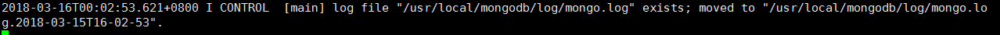
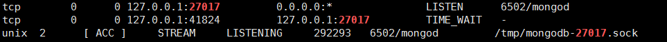

#linux服务器mongodb数据库安装

1. 创建一文件夹，存放将要下载的mongodb文件.
  ```
    mkdir /usr/local/mongodb
  ```
2. 下载你需要的mongodb文件[https://fastdl.mongodb.org/linux/mongodb-linux-x86_64-ubuntu1404-3.6.3.tgz](https://fastdl.mongodb.org/linux/mongodb-linux-x86_64-ubuntu1404-3.6.3.tgz)
  ```
    wget https://fastdl.mongodb.org/linux/mongodb-linux-x86_64-ubuntu1404-3.6.3.tgz
  ```
3. 解压文件,解压到mongodb文件夹下
  ```
    tar -xvf mongodb-linux-x86_64-ubuntu1404-3.6.3.tgz -C /usr/local/mongodb/
  ```
4. 创建数据保存路径
  ```
    mkdir /usr/local/mongodb/data
  ```
5. 创建数据保存路径
  ```
    mkdir /usr/local/mongodb/log
  ```
6. 修改解压后生成的文件， 
  ```
    mv mongodb-linux-x86_64-1404-3.6.3 server
  ```
7. 进入mongodb文件的bin目录下，准备启动mongodb
  ```
    cd usr/local/mongodb/server/bin/
  ```
8. 启动和配置文件和日志保存的路径
  ```
    ./mongod --dbpath=/usr/local/mongodb/data/ --logpath=/usr/local/mongodb/log/mongo.log
  ```
  >出现下面所显示的证明 启动和配置文件和日志保存路径成功

  

9. 这个时候，mongodb已经启动完成了，如需对mongodb进行操作，需要另打开一个终端，链接到服务器，进入到usr/local/mongodb/server/bin/目录下
  ```
    cd usr/local/mongodb/server/bin/
  ```
10. 输入命令启动mongodb数据库
  ```
    ./mongo
  ```
>提示Server has startup warnings: 服务已经启动，然后就可以对数据库进行操作了，比如增，删，改，查.完成了，是不是很简单啊！
11. 检查是不是这个数据库已经开启了
  ```
    netstat -lanp | grep "27017"
  ```
  >显示如下图片证明数据库已经开启
  


### 我还是感觉比较麻烦，要是一开机能自己启动那该多好啊！！！

1. 进入/etc,编辑rc.local文件
  ```
    vi rc.local
  ```
2. 加入下面这行代码
  ```
    /usr/local/mongodb/server/bin/mongod  --dbpath=/usr/local/mongodb/data --logpath=/usr/local/mongodb/log/mongo.log --logappend  --port=27017 --fork --auth
  ```
3. 然后在终端中执行一次设置的命令,查看端口再一次,使配置文件生效
 大功告成了。

4. 关闭数据库
  ```
    ./mongod --dbpath /usr/local/mongodb/data --shutdown
  ```