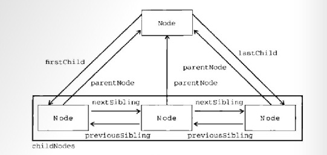

### DOM对象操作

 - **Node对象关系图**
  

 - 跨浏览器把NodeList 转化为数组
```js
  const convertToArray = nodes => {
    array = null;
    try {
      array = Array.prototype.slice.call(nodes, 0); // 针对非IE浏览器(在IE8以前 不支持这句代码)
    } catch (err) {
      array = new Array();
      for (let i = 0; i < nodes.length; i++) {
        array.push(nodes[i]);
      }
    }
  }
```